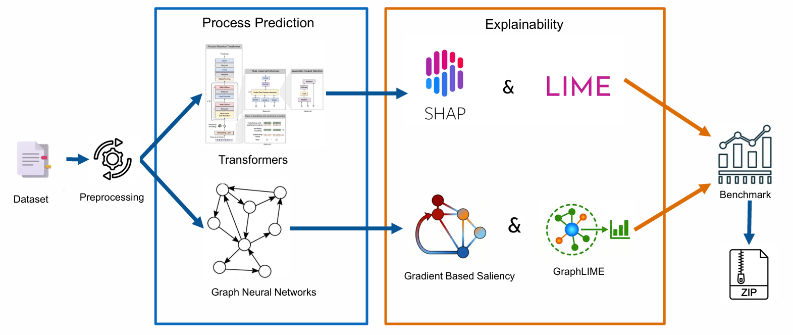
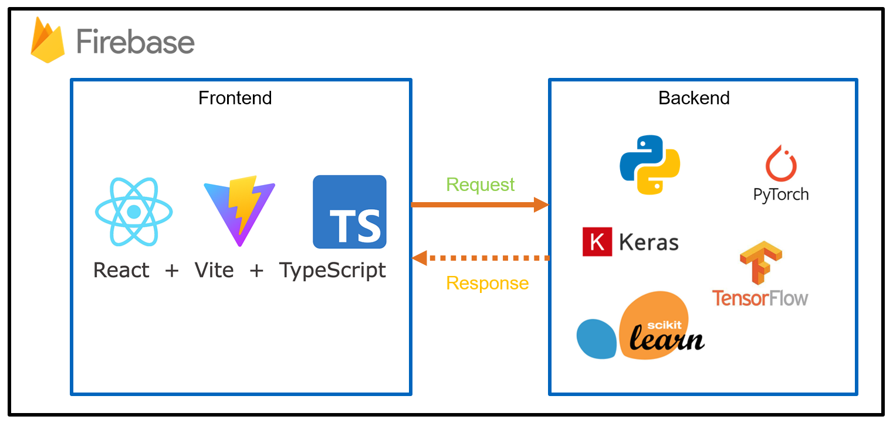
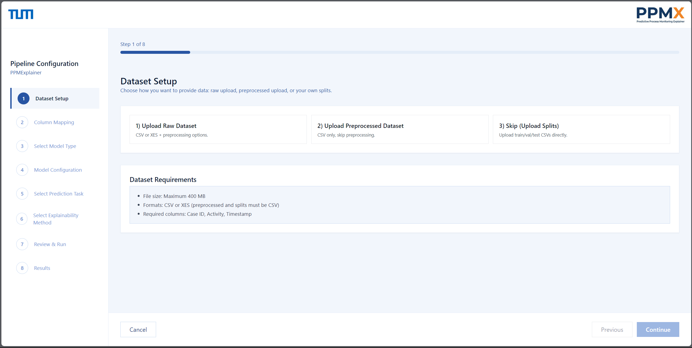

# PPMX (Predictive Process Monitoring Explainer)

PPMX (Predictive Process Monitoring Explainer) is a tool for Predictive Process Monitoring (PPM) which provides fast and easy No Code solution for process prediction and explainability to black box models like Transformer and Graph Neural Networks (GNNs) with explainability and benchmarking. It is designed for experimentation on event logs, and allows users to train models, inspect results, and compare explainability methods in a single workflow.

**PPMX Architecture**


**Key Features**
- No-code workflow for training and explainability.
- Transformer and GNN support for next activity, event time, and remaining time.
- Explainability and benchmarking in one pipeline.
- Frontend dashboard powered by a FastAPI backend


**Tech Stack**
- Frontend: Vite + React + TypeScript
- Backend: FastAPI + Python
- ML: TensorFlow, PyTorch, PyTorch Geometric

**PPMX System Structure and APIs**
This diagram summarizes the frontend-backend structure and the APIs used across the system.


**Requirements**
- Python 3.10+ recommended
- Node.js 18+ recommended

**Quickstart (Frontend + Backend)**

1. Create and activate a Python virtual environment.
```bash
python -m venv .venv
# Windows PowerShell
.venv\Scripts\Activate.ps1
# macOS/Linux
# source .venv/bin/activate
```

2. Install backend dependencies.
```bash
pip install -r backend/requirements.txt
```

3. Start the backend API.
```bash
uvicorn backend.main:app --reload --port 8000
```

4. In a new terminal, install frontend dependencies.
```bash
cd frontend
npm install
```

5. Configure the frontend API base URL.
```bash
# macOS/Linux
cp .env.example .env.local 2>/dev/null || true
# Windows PowerShell
# Copy-Item .env.example .env.local -ErrorAction SilentlyContinue
```

Add the following to `frontend/.env.local`:
```bash
VITE_API_BASE_URL=http://localhost:8000
```

6. Start the frontend dev server.
```bash
npm run dev
```

Frontend will be available at `http://localhost:5173`.

**Starting Dashboard**


**Hosted Version**
```
https://explainability-bedf8.web.app/
```

**Usage Workflow**
1. Preprocess the event log: upload raw CSV/XES or a preprocessed CSV. Optionally skip preprocessing by uploading pre-split datasets via the GUI. Map required columns (case ID, activity, timestamp; resource optional). For standardized BPI 2017/2020 logs, automatic column detection is supported in batch/CLI.
2. Train and predict: choose Transformer or GNN and select a task. Classification supports next-activity and custom target prediction; regression supports event-time and remaining-time. Configure hyperparameters in the GUI or use defaults, then run training and generate test-set predictions.
3. Explainability analysis: for Transformers, use SHAP (feature importance bar + beeswarm) and LIME (local explanation plots). For GNNs, use gradient-based saliency (global bar plots) and GraphLIME (local plots). Regression tasks also generate temporal attribution plots.
4. Benchmarking: compute faithfulness, comprehensiveness, sufficiency, monotonicity, and method agreement to compare explanation quality.
5. Export artifacts: each run is packaged as a ZIP containing the trained model, prediction CSVs, explainability plots, and benchmarking summary for reproducibility.

**Project Structure**
- `frontend/` Frontend app (Vite + React).
- `backend/` FastAPI service for training and inference.
- `BPI_dataset/` Sample datasets used for experiments.
- `explainability/` Explainability methods and reports.
- `gnns/` GNN training and prediction pipeline.
- `transformers/` Transformer training and prediction pipeline.

**Troubleshooting**
- If you see port conflicts, change the backend port and update `VITE_API_BASE_URL`.
- If training is slow, reduce dataset size or use a GPU-enabled environment.

**License**
Open source for educational use.
