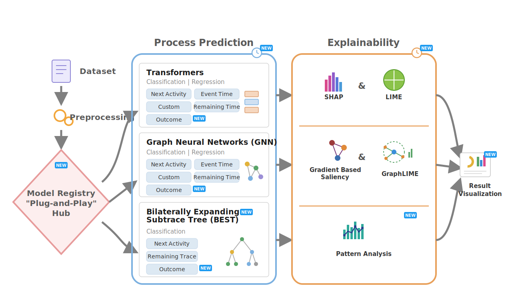
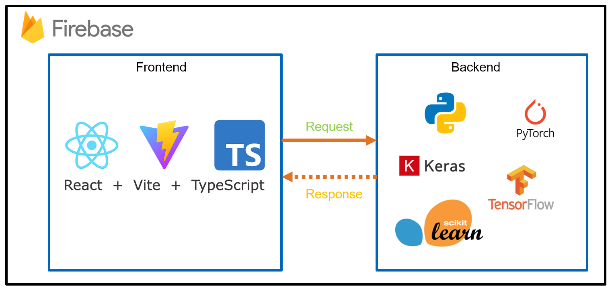
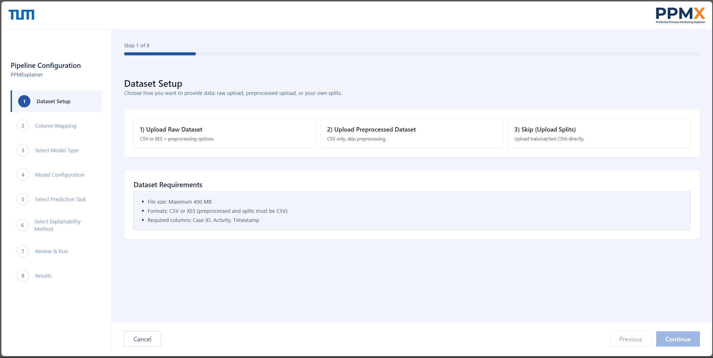

# PPMX (Predictive Process Monitoring Explainer)

PPMX (Predictive Process Monitoring Explainer) is a No-Code tool for Predictive Process Monitoring (PPM). It provides a fast and easy workflow for process prediction and explainability over black-box models such as Transformers, Graph Neural Networks (GNNs), and the tree-based BEST model, together with explainability and benchmarking. It is designed for experimentation on event logs, and lets users train models, inspect results, and compare explainability methods in a single workflow.

**Architecture Overview**

The system is organized as a **plug-and-play model registry**: a dataset is preprocessed, then routed through the registry to any registered prediction model (Transformer, GNN, or BEST). Each model exposes prediction tasks (Next Activity, Custom, Event Time, Remaining Time/Trace, and **Outcome**) and pairs with matching explainability methods, all feeding a unified result-visualization layer. The `NEW` badges mark the most recent additions.

**Software Architecture**



**Key Features**
- No-code workflow for training, prediction, explainability, and benchmarking.
- Three model families: **Transformer**, **GNN**, and **BEST** (Bilaterally Expanding Subtrace Tree).
- Prediction tasks: next activity, custom (categorical) target, event time, remaining time, remaining trace, and **outcome** prediction.
- Per-model explainability: SHAP & LIME (Transformer), Gradient-based saliency & GraphLIME (GNN), and Pattern Analysis (BEST).
- Explainability benchmarking (faithfulness, comprehensiveness, sufficiency, monotonicity, method agreement).
- **Plug-and-play model registry:** add a new model by implementing one adapter class and declaring its capabilities — the frontend wizard renders itself automatically (see [Plug-and-Play: Adding a New Model](#plug-and-play-adding-a-new-model)).
- Frontend dashboard powered by a FastAPI backend.


**Tech Stack**
- Frontend: Vite + React + TypeScript
- Backend: FastAPI + Python
- ML: TensorFlow, PyTorch, PyTorch Geometric, best4ppm

**PPMX System Structure and APIs**
This diagram summarizes the frontend-backend structure and the APIs used across the system.


**Requirements**
- Python 3.12 recommended
- Node.js 18+ recommended

**Quickstart (Frontend + Backend)**
Clone the repository first and then follow the steps: 
1. Create and activate a Python virtual environment.
```bash
python3.12 -m venv .venv
# Windows PowerShell
.venv\Scripts\Activate.ps1
# macOS/Linux
source .venv/bin/activate
```

2. Install all ML and project dependencies.

```bash
python install.py
```

3. Install backend-only dependencies (FastAPI runtime).
```bash
pip install -r backend/requirements.txt
```

4. Start the backend API.
```bash
uvicorn backend.main:app --reload --port 8000
```

5. In a new terminal, install frontend dependencies.
```bash
cd frontend
npm install
```

6. Configure the frontend API base URL.
```bash
# macOS/Linux
cp .env.example .env.local 2>/dev/null || true
# Windows PowerShell
# Copy-Item .env.example .env.local -ErrorAction SilentlyContinue
```

Add the following to `frontend/.env.local`:
```bash
VITE_API_BASE_URL=http://localhost:8000
```

7. Start the frontend dev server.
```bash
npm run dev
```

Frontend will be available at `http://localhost:5173`.

**Starting Dashboard**


**Hosted Version**
```
https://explainability-bedf8.web.app/
```

**Usage Workflow**
1. Preprocess the event log: upload raw CSV/XES or a preprocessed CSV. Optionally skip preprocessing by uploading pre-split datasets via the GUI. Map required columns (case ID, activity, timestamp; resource optional). For standardized BPI 2017/2020 logs, automatic column detection is supported in batch/CLI.
2. Train and predict: choose a model (Transformer, GNN, or BEST) and select a task. Transformers and GNNs support next-activity, custom target, event-time, remaining-time, and outcome prediction; BEST supports next-activity, remaining-trace, and outcome prediction. Configure hyperparameters in the GUI or use defaults, then run training and generate test-set predictions.
3. Explainability analysis: for Transformers, use SHAP (feature importance bar + beeswarm) and LIME (local explanation plots). For GNNs, use gradient-based saliency (global bar plots) and GraphLIME (local plots). For BEST, use Pattern Analysis (top matched subtrace patterns, activity importance, high-error patterns, and confidence distributions). Regression tasks also generate temporal attribution plots.
4. Benchmarking: compute faithfulness, comprehensiveness, sufficiency, monotonicity, and method agreement to compare explanation quality.
5. Export artifacts: each run is packaged as a ZIP containing the trained model, prediction CSVs, explainability plots, and benchmarking summary for reproducibility.

**Project Structure**
- `frontend/` Frontend app (Vite + React); renders itself from the backend capability manifest.
- `backend/` FastAPI service for training and inference (serves `GET /capabilities`).
- `models/` Plug-and-play model registry: `base_predictor.py` (adapter contract), `registry.py` (`"<model>:<task>"` → wrapper), `capabilities.py` (declarative manifest), and one `*_predictor.py` adapter per model.
- `transformers/` Transformer training and prediction pipeline.
- `gnns/` GNN training and prediction pipeline.
- `best/` BEST (Bilaterally Expanding Subtrace Tree) training and prediction pipeline.
- `explainability/` Explainability methods and reports.
- `BPI_dataset/` Sample datasets used for experiments.

## Plug-and-Play: Adding a New Model

PPMX uses a **model registry** (Strategy pattern) so a new model plugs in without touching the backend routing or the frontend UI. Every model is an *adapter* that maps its own API onto a uniform five-method lifecycle; a declarative manifest then tells the frontend how to render the wizard. Concretely, adding a model `mymodel` takes four steps.

**1. Provide the concrete predictor (the actual ML code).**
Add your training/inference implementation under a package of its own (e.g. `mymodel/`), or reuse an existing library. This code stays unmodified — the adapter in the next step wraps it. It should be able to prepare data from a standardized DataFrame (`case:id` / `concept:name` / `time:timestamp`), train, evaluate, and save results/plots/model to an output directory.

**2. Write an adapter that implements `BasePredictor`.**
Create `models/mymodel_predictor.py` subclassing `models/base_predictor.py:BasePredictor` and implement its five lifecycle methods. Import the heavy concrete predictor **lazily inside `__init__`** so importing the registry never pulls in TensorFlow/PyTorch/etc.

```python
# models/mymodel_predictor.py
from .base_predictor import BasePredictor

# Orchestration keys injected by the pipeline; strip before passing to your model.
_RESERVED_KEYS = {
    "test_size", "val_split", "output_dir", "explainability_method",
    "explainability_samples", "model_type", "task", "target_column",
}


class MyModelWrapper(BasePredictor):
    def __init__(self, config):
        self.config = config
        self.output_dir = config.get("output_dir")
        self.task = config.get("task")
        model_config = {k: v for k, v in config.items() if k not in _RESERVED_KEYS}
        from mymodel.predictor import MyModelPredictor   # lazy import
        self.predictor = MyModelPredictor(**model_config)

    def prepare_data(self, df):
        return self.predictor.prepare_data(df, test_size=self.config["test_size"])

    def train(self, data):
        self.predictor.build_model()
        self.predictor.train(data)
        return data

    def evaluate(self, test_data):
        metrics = self.predictor.evaluate(test_data)
        self.predictor.save_results(test_data, self.output_dir)
        self.predictor.save_model(self.output_dir)
        return metrics

    def explain(self, test_data):
        if not self.config.get("explainability_method"):
            return  # explainability is optional; no-op when not requested
        # ... run your explainer and write plots into self.output_dir ...
```

**3. Register the model in `models/registry.py`.**
Import the wrapper and add one `"<model>:<task>"` entry per supported task to `MODEL_REGISTRY`. The key format is `"<model_id>:<task_id>"`; `get_predictor` splits it and injects `model_type` / `task` into the config automatically.

```python
from .mymodel_predictor import MyModelWrapper

MODEL_REGISTRY = {
    # ... existing entries ...
    "mymodel:next_activity": MyModelWrapper,
    "mymodel:outcome": MyModelWrapper,
}
```

**4. Declare capabilities in `models/capabilities.py`.**
Append one dict to `MODEL_CAPABILITIES`. This is the single source of truth for the UI — `id`, `label`, `description`, the `tasks` list, the `config_fields` schema (labels, defaults, and validation rules), any cross-field `config_constraints`, and the `explain_methods`. Keep the task ids in sync with the registry keys and the config field keys in sync with your predictor's constructor arguments.

```python
{
    "id": "mymodel",
    "label": "My Model",
    "description": "One-line description shown in the model picker.",
    "tasks": [
        {"id": "next_activity", "label": "Next Activity Prediction",
         "description": "...", "category": "classification"},
        {"id": "outcome", "label": "Outcome Prediction",
         "description": "...", "category": "classification"},
    ],
    "config_fields": [
        {"key": "epochs", "label": "Number of epochs", "default": 5,
         "kind": "number", "integer": True, "gt": 0, "step": 1},
        # ... one entry per constructor hyperparameter ...
    ],
    "config_constraints": [],
    "explain_methods": [
        {"value": "none", "label": "None", "description": "Skip explainability."},
        # ... your methods ...
    ],
}
```

**That's it — no other code changes.** The backend serves the new model from `GET /capabilities`, and the frontend wizard (`Step2Model` → `Step3Prediction` → `Step4Explainability` → `Step5Config`) renders the model card, task list, config form, and explainability options automatically from the manifest. The pipeline runs your model through the uniform lifecycle:

```python
from models.registry import get_predictor

predictor = get_predictor("mymodel:outcome", config)   # config carries hyperparameters + runtime keys
data = predictor.prepare_data(df)
predictor.train(data)
metrics = predictor.evaluate(data)
predictor.explain(data)
```

**Troubleshooting**
- If you see port conflicts, change the backend port and update `VITE_API_BASE_URL`.
- If training is slow, reduce dataset size or use a GPU-enabled environment.
- If a new model does not appear in the UI, confirm its `id` in `capabilities.py` matches the `"<model>:<task>"` prefix in `registry.py`, and reload `GET /capabilities`.

**License**
Open source for educational use.
